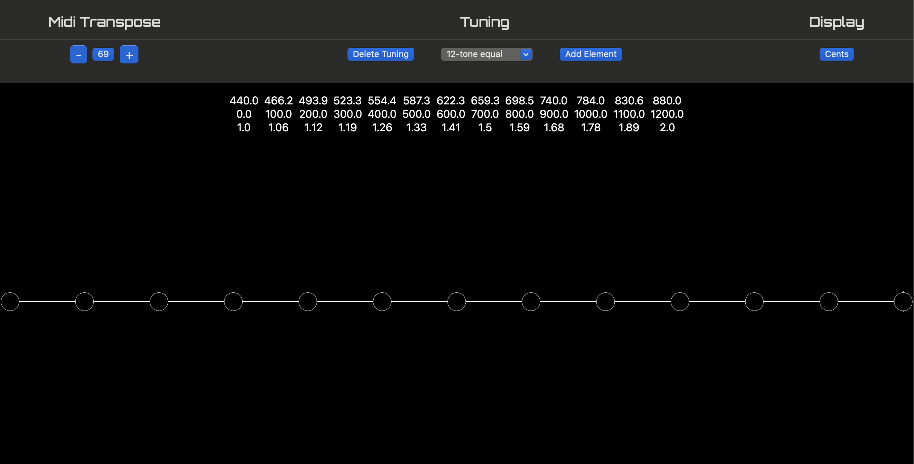
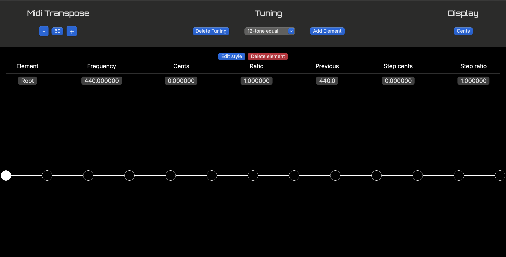
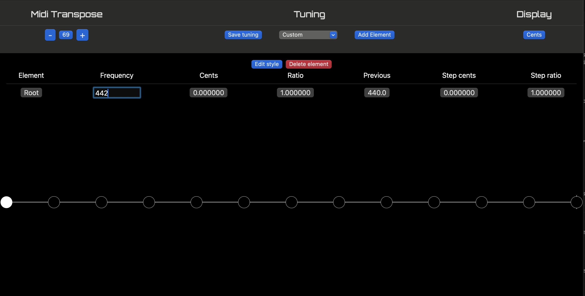
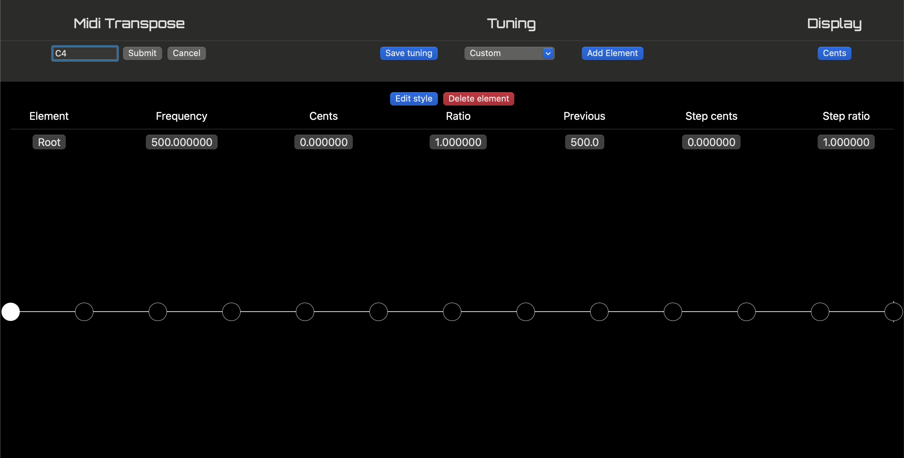
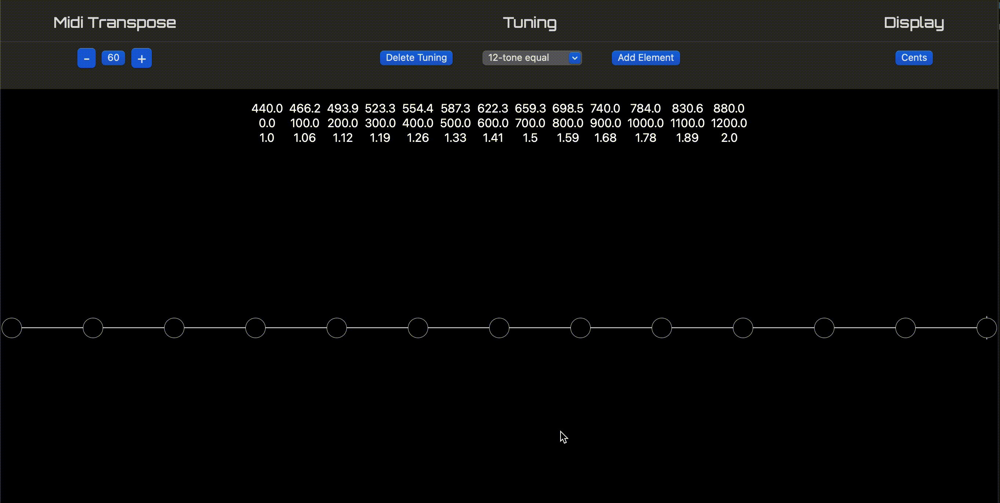
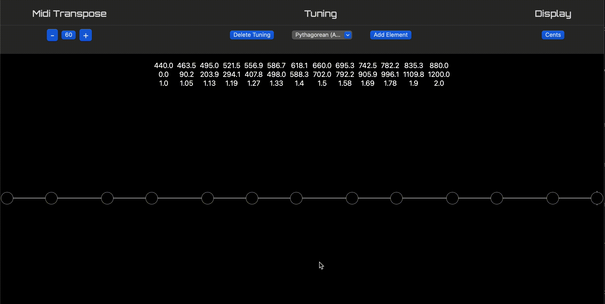
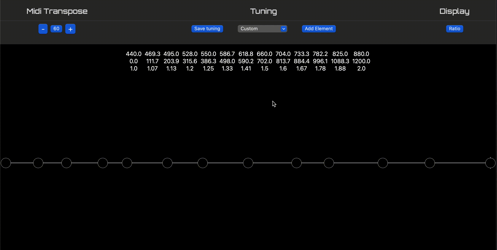

Let's have some fun with the Microton's tuning system.

The Microton defaults to 12-tone equal temperament (or 12-TET for short) at A440. (Each element's frequency is exactly 100 cents from the previous element, using A4 = 400hz as a starting point.) When we click on each element on the monochord, we can see its properties in the Element Editor.

<!--truncate-->

Experimenting with alternate standards is simple; we select the root element and input a different frequency. Here, as a tribute to Leonard Bernstein, we retune to A442:

The monochord updates all of the other elements (and, by extension, the MIDI map) using the new tuning standard.

What if we want to do something weird, like C4 = 500hz? Retune the root to 500hz, and input 'C4' in the MIDI transpose field:

We can also modify the elements directly to create our own tuning systems. One way is to simply click/touch and element and drag across the monochord:

For more precision we'll turn back to the Element Editor. First, let's load the Just 5-Limit Augmented 4 tuning. To transform this tuning into its closely related Just 5-Limit Diminished 5 intonation, we modify the ratio of the tritone to 45/32.

Finally, we can use the tuning system to quickly generate tuning templates to experiment with by using the 'Generate Equaltone Tuning' option. Here, we generate a quarter-tone tuning:

And another example, where we generate a 9-tone equal tone tuning, then remove the second and sixth elements, which is the basis for the Microton's preset version of the Javanese Pelog tuning:

\

Simple to learn, endless potential. Microton gives you the tools to speak any musical language - or create your own.