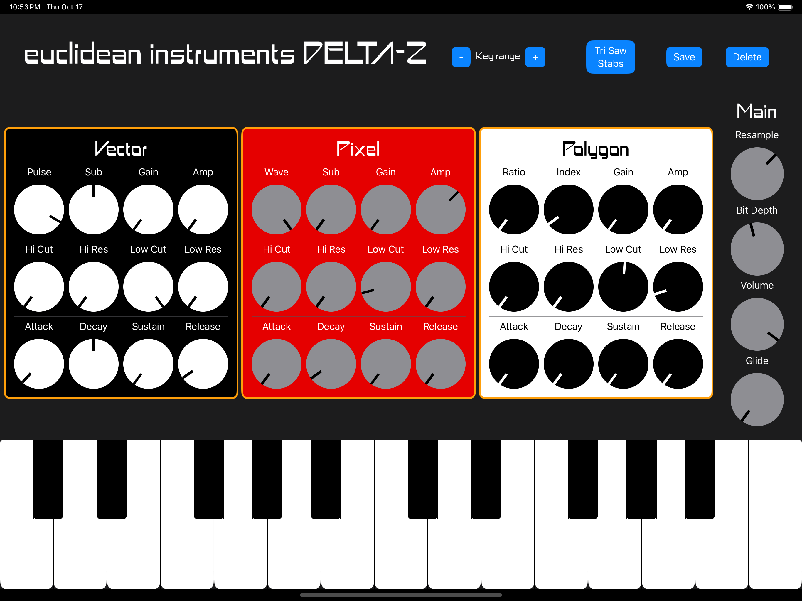

# Delta-Z chiptune synth

The Euclidean Instruments Delta-Z virtual synth brings together three generations of beeps and bloops in a simple, musician-friendly instrument.

Delta-Z features three distinct, combinable sound modules:
    
    - VECTOR emulates the sounds of classic arcade games and first-generation consoles from the 1970s-80s with a monophonic PWM wave oscillator + sub.
    - PIXEL breakthrough home consoles and computers of the late 1980s with a monophonic oscillator + sub which can morph between sawtooth and triangle waveforms.
    - POLYGON produces the aggressive sounds of 90s consoles with a six-voice polyphonic FM synthesis operator.

Each module also contains overdrive, high- and low-pass filters, and an ADSR envelope.

Delta-Z is available on the Apple App Store for OSX and iPad. The OSX version includes an Audio Unit (AUv3) component -- take all of your new sounds to your favorite DAW.

Get Delta-Z on the Apple App Store here:

