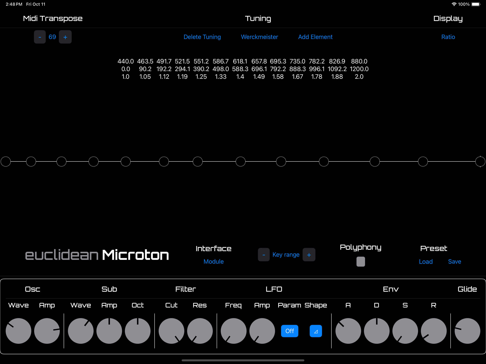
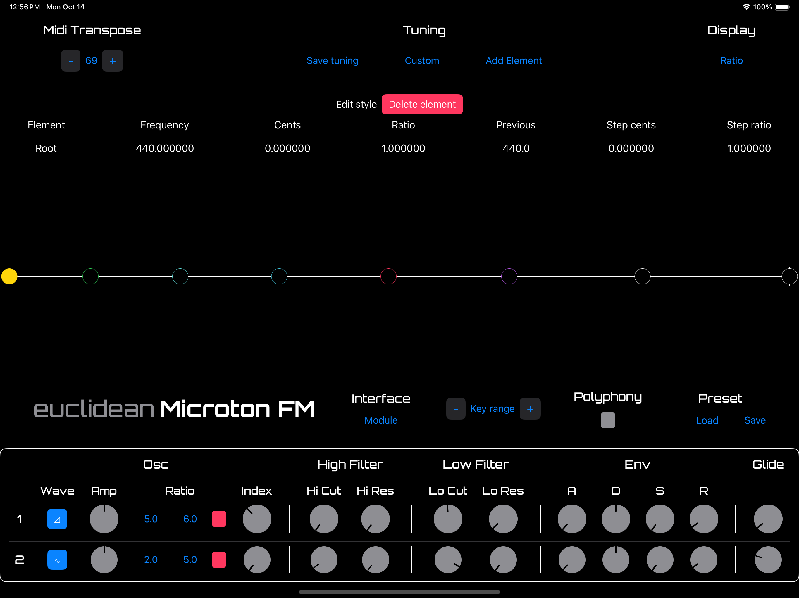

# Microton synth series

The Euclidean Instruments Microton is a virtual synthesizer series with a fresh approach to making microtonal music. 

At the heart of the Microton is the ‘monochord’: a touch-sensitive visual representation of the instrument’s current tuning as a simple line segment. Selecting a built-in tuning (ranging across antiquity to the 21st century, from cultures around the world) will automatically update the monochord, displaying the unique mathematical relationships of that tuning’s elements. Users can directly interact with the tuning’s elements by moving its icon along the monochord with the touchscreen, or by modifying the element’s properties via the Element Editor. Adding and deleting elements from the tuning is as easy as a button tap. Want to dive deeper? The Element Editor supports mathematical expressions as input, allowing you to precisely sculpt your tuning.

Once you’ve created your new tuning, you can also redesign the visual keyboard — modify each key’s color, name, and key rank to completely personalize your tuning.

The Microton’s sound engine produces warm, rich analog tones inspired by the classic synths of the 70s and 80s. The oscillators (6-voice polyphony, 2-voice mono with lead and sub) can morph between four preset waveforms, allowing for a wide range of timbres which can be fed into the thick-as-molasses low-pass filter to produce rumbling basses, spectral pads, space-age sound effects, and everything in between.

Get Microton on the Apple App Store here!

The Microton FM’s sound engine produces the harmonically rich tones inspired by the groundbreaking FM synths of the 80s and 90s. The two FM operators (6-voice polyphony, 1-voice mono) each produce four selectable waveforms which can be further shaped with the controller and modulation parameters, allowing for spacey digital pianos and mallet sounds, searing leads, otherworldly digital soundscapes, and everything in between.

Microton runs on desktop, iPad, and your favorite DAW as an Audio Unit v3 plugin. All of your saved patches and tunings will be shared system-wide — so custom tunings made in the desktop app will be available in the Audio Unit, and vice versa.

Snag Microton FM on the Apple App Store here!

