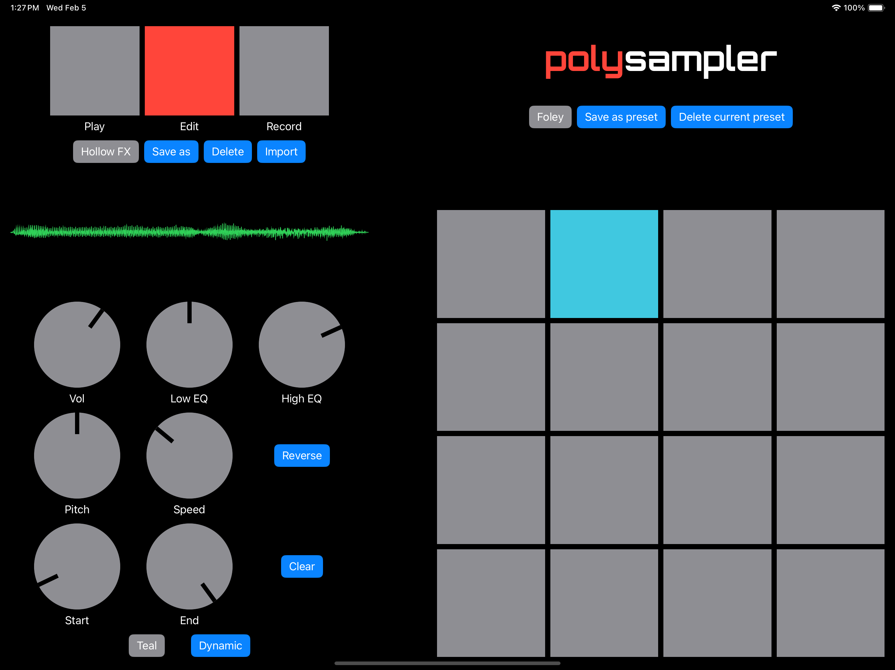

# PolySampler sampling workstation

PolySampler is a powerful, easy to use sampling instrument for iOS devices. Import sound files or record high-quality audio using your built-in microphone, then map those samples to the on-screen pads. Each pad includes an independent EQ and processor which can manipulate the playback pitch, speed, and length. The main output also has built-in delay and reverb effects. Individual samples can be saved to the internal PolySampler sample library. Users can also create and save presets to quickly load a set of samples and parameter settings.

Get Polysampler on the Apple App Store here:

